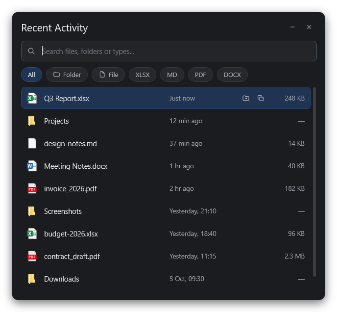

# LastFolder

*Your recent files, one shortcut away.*

[](https://github.com/00xSky/LastFolder/releases/latest)


[](LICENSE)

Press **Left Ctrl + Space** anywhere in Windows to jump back to the files and folders you opened recently.

The **Folder** and **File** filters are always there. The rest change on their own: they show the extensions that appear most often among your last 20 files (up to 4), most frequent first.

**[⬇ Download the latest release](https://github.com/00xSky/LastFolder/releases/latest)**



## Download

1. Download `LastFolder-<version>-win-x64.zip` from the [latest release](https://github.com/00xSky/LastFolder/releases/latest).
2. Unzip it anywhere and run `LastFolder.exe`. It goes straight to the system tray.
3. Press **Left Ctrl + Space**.

LastFolder needs the [.NET 9 Desktop Runtime](https://dotnet.microsoft.com/download/dotnet/9.0) (x64). If it is missing, Windows offers to download it on first start.

The exe is not code-signed, so Windows SmartScreen may warn the first time you run it. Click **More info → Run anyway**.

## Features

- Global shortcut: **Left Ctrl + Space** opens the launcher on the screen where your mouse is (Right Ctrl + Space and other modifier combinations are left alone).
- Lists your recently opened files and folders, newest first, with real Windows icons, relative times and file sizes.
- Instant search as you type. Every word must appear in the name; a word starting with a dot (for example `.pdf`) filters by extension.
- Filter chips: **All**, **Folder**, **File**, plus the extensions you used most among your recent files.
- Open an item, show it in its folder, or copy its full path.
- Lives in the system tray; the window hides when it loses focus.
- English and Turkish UI.
- Optional "Start with Windows".

## Usage

| Key / action | What it does |
| --- | --- |
| **Left Ctrl + Space** | Show / hide the launcher |
| Type | Search by name (`.ext` filters by extension) |
| **Up / Down** | Move the selection |
| **Page Up / Page Down** | Move the selection by 8 rows |
| **Enter** | Open the selected item |
| **Ctrl + Enter** | Show the selected item in its folder |
| **Ctrl + C** | Copy the selected item's path (when no search text is selected) |
| **Tab / Shift + Tab** | Cycle through the filter chips |
| **Esc** | Hide the launcher |
| Double-click a row | Open the item |
| Row buttons | Show in folder / copy path |
| Drag the header | Move the window |

Tray icon: left-click opens the launcher; right-click opens the menu (Open, Start with Windows, Language, Exit). Closing the window (or Alt+F4) only hides it; use **Exit** in the tray menu to quit. Starting the app again while it is running just brings up the launcher.

Command-line switches: `--silent` starts without the tray balloon, `--show` opens the launcher right away.

## Requirements

- Windows 10 or Windows 11 (x64)
- To run: [.NET 9 Desktop Runtime](https://dotnet.microsoft.com/download/dotnet/9.0)
- To build: [.NET 9 SDK](https://dotnet.microsoft.com/download/dotnet/9.0)

## Build from source

```powershell
git clone https://github.com/00xSky/LastFolder.git
cd LastFolder
dotnet run
```

Publish a single-file release build, the same way the release zip is made:

```powershell
dotnet publish -c Release -r win-x64 --self-contained false -p:PublishSingleFile=true -p:DebugType=none -o publish
```

Then run `publish\LastFolder.exe`. Use `--self-contained true` if the target machine has no .NET runtime installed.

For development, `LastFolder.exe --snapshot <file.png>` renders the launcher to a PNG and exits; add `--demo` to use made-up sample items in English (that is how the screenshot above was made).

## Language

The UI is in English by default. Switch it from the tray menu: **Language → English / Türkçe**. The change applies immediately and is remembered per user (`HKCU\Software\LastFolder`, value `Language`). Dates and numbers follow the selected language.

## Start with Windows

Tick **Start with Windows** in the tray menu. This adds a `LastFolder` entry under `HKCU\Software\Microsoft\Windows\CurrentVersion\Run` that starts the app with `--silent`; untick it to remove the entry.

## How it works

Windows keeps a shortcut (`.lnk`) for every file and folder you open in `%APPDATA%\Microsoft\Windows\Recent`. Each time the launcher opens, LastFolder reads that folder, resolves the shortcuts with `IShellLink`, drops entries that no longer exist (network paths are not checked, so an offline server cannot freeze the app) and skips `.exe` / `.lnk` targets. The shortcut is caught with a low-level keyboard hook (`WH_KEYBOARD_LL`), because `RegisterHotKey` cannot tell the left and right Ctrl keys apart.

## Privacy

LastFolder only reads your local Recent folder. It has no network code, collects nothing and sends nothing anywhere; everything stays on your machine.

## License

Free to use, modify and share, but not to sell.

LastFolder is released under the MIT License with the [Commons Clause](https://commonsclause.com/) condition. You may use, copy, modify and redistribute it, at home or at work. You may not sell it, or sell a product or service whose value comes mainly from it. See [LICENSE](LICENSE) for the full text.

Because of the Commons Clause, LastFolder is source-available rather than open source in the OSI sense.
